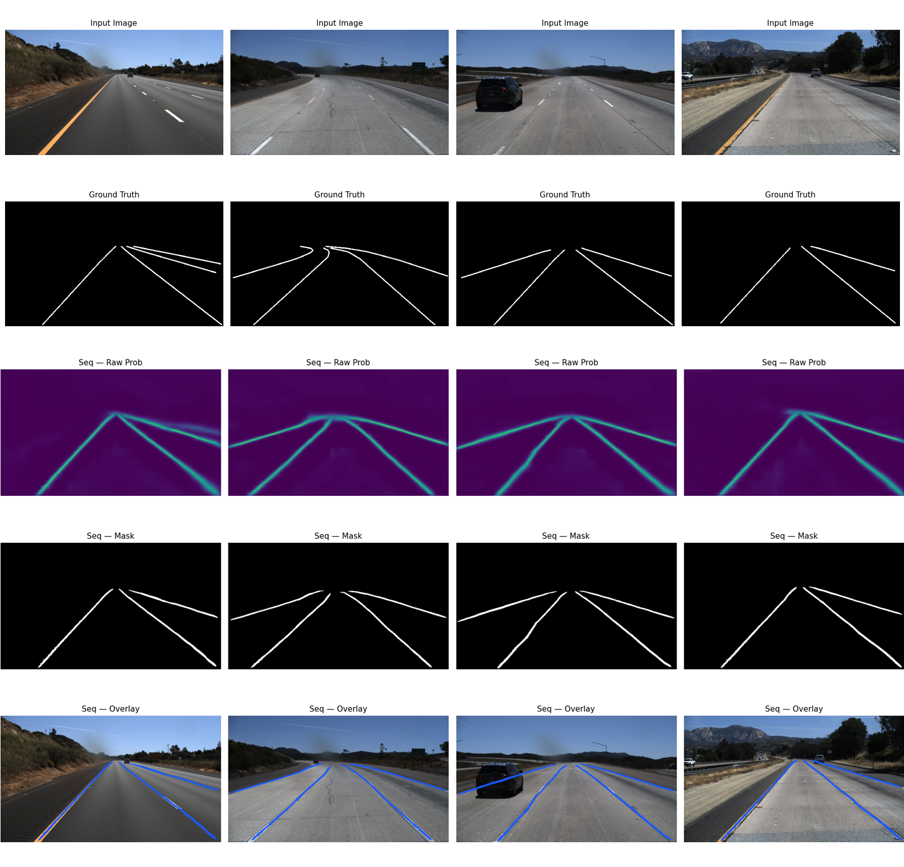

# ST-LaneNet

Lane line detection combining a bird's-eye-view edge proposal network with Swin Transformer global context modelling on [TuSimple](https://www.kaggle.com/datasets/manideep1108/tusimple) highway images.

Two variants — **sequential** and **parallel** — were implemented and ablated to resolve an architectural ambiguity in the original paper. The sequential variant is recommended: statistically equivalent accuracy, 25% faster.



---

## Results

| Model | Accuracy | TPR | FPR | F1 | FPS |
|---|---|---|---|---|---|
| `STLaneNet_Seq` | **91.86%** | 80.17% | 12.18% | **83.82%** | **162.9** |
| `STLaneNet_Par` | 91.75% | 80.20% | 12.64% | 83.63% | 130.2 |
| *Paper (Du et al., 2024)* | *98.85%* | *97.5%* | *3.8%* | *~0.94* | *64.8* |

**Reproduction verdict:** Architecture faithfully reproduced. The 6.99 pp accuracy gap is a training-step deficit (4,050 vs 80,000 steps), not an architectural failure. FPS claim surpassed 2.5× (162.9 vs 64.8). The sequential/parallel ambiguity in the paper resolves empirically in favour of `STLaneNet_Seq`.

---

## Architecture (overview)

ST-LaneNet is a dual-branch network operating at 368×640 resolution.

**Branch 1 — Edge Proposal (bird's-eye view)**
```
Image → IPM warp (H) → SpatialPriorHead → binary mask
Image/mask → EdgeEncoder (depthwise-separable, dilated) → CARAFE decoder → warp back (H⁻¹)
```

**Branch 2 — Localization (front-view)**
```
Image → Swin-Tiny (4 stages) → loc_reduce (768→128) → bilinear upsample
```

**Fusion head:** concat [edge 64ch, loc 128ch] → 192ch → Conv → 1×368×640 lane logit.

Total: ~29,656K parameters (Swin-Tiny alone = 95.4%).

→ [Full architecture details, layer-by-layer table, parameter count](docs/architecture.md)

---

## Quickstart

```bash
pip install marimo openmim
```

Dataset is auto-downloaded from Kaggle on first run. Set Kaggle credentials:
```bash
# Option 1: file
echo "KGAT_..." > ~/.kaggle/access_token

# Option 2: env vars
export KAGGLE_API_TOKEN=KGAT_...
export KAGGLE_USERNAME=your_username
```

**Training + Evaluation (combined notebook):**
```bash
marimo run notebook.py    # headless
marimo edit notebook.py   # interactive / debug
```

The notebook trains both variants sequentially (Par then Seq), then runs evaluation with GT-guided metrics and saves figures to `report_figures/`.

**Load pre-trained weights instead of training:**

Weights are pulled automatically from Kaggle at the start of the evaluation section if `./ST_LaneNet_Weights/STLaneNet_Par_best.pth` and `STLaneNet_Seq_best.pth` are not present.

---

## Repository layout

```
notebook.py                 # Marimo notebook: training + evaluation (canonical source)
notebook.ipynb              # Jupyter export from Marimo platform (read-only snapshot)
report_figures/             # Auto-generated by notebook.py (figures for the report)
stln-par/{1,5,10,...}.png   # Par model training progression snapshots
stln-seq/{1,5,10,...}.png   # Seq model training progression snapshots
ST_LaneNet_Weights/         # Checkpoint directory (created on first training run)
docs/                       # Extended documentation (this repo)
```

---

## Documentation

| File | Contents |
|------|----------|
| [docs/related-work.md](docs/related-work.md) | Traditional methods → deep learning; why ST-LaneNet |
| [docs/architecture.md](docs/architecture.md) | IPM, SpatialPriorHead, DSConv math, CARAFE, Swin Transformer, Par vs Seq, layer-by-layer table, parameter count |
| [docs/critical-analysis.md](docs/critical-analysis.md) | Flaws in the original paper: FC-1000, fusion mislabelling, IPM absence, Seq/Par contradiction, Swin confusion, 80k epochs typo |
| [docs/training.md](docs/training.md) | Focal Loss derivation, hyperparameters, GT mask generation, bfloat16 vs float16, `.detach()` constraint, gradient clipping, infrastructure |
| [docs/results.md](docs/results.md) | GT-guided evaluation algorithm, ablation table, post-processing, SOTA comparison, training curves, qualitative analysis, limitations, ethics |

---

## Dataset & Weights

| Resource | Link |
|----------|------|
| TuSimple dataset (Kaggle) | https://www.kaggle.com/datasets/manideep1108/tusimple |
| Trained weights (Kaggle) | https://www.kaggle.com/datasets/youtikig/st-lanenet-weights-backup |

---

## Reference

```
Y. Du, R. Zhang, P. Shi, L. Zhao, B. Zhang and Y. Liu,
"ST-LaneNet: Lane line detection method based on Swin Transformer and LaneNet,"
Chinese Journal of Mechanical Engineering, vol. 37, 2024.
https://doi.org/10.1186/s10033-024-00992-z
```
