# Results & Evaluation

---

## Evaluation Protocol

### TuSimple Accuracy

The official TuSimple metric counts the fraction of annotated lane points that are correctly predicted:

$$\text{Acc} = \frac{N_{\text{pred}}}{N_{\text{gt}}}$$

where $N_{\text{pred}}$ is the number of GT lane points with a predicted pixel within ±10 px, and $N_{\text{gt}}$ is the total number of annotated points.

### Lane-Level TP/FP/FN

Lane-level metrics (TPR, FPR, F1) require defining TP, FP, FN at the individual lane level. A naive connected-component approach over the predicted mask catastrophically over-counts FP and FN: dashed lane markings fragment into dozens of small blobs, each individually failing the coverage threshold.

**We use GT-guided evaluation** — the model never sees annotations during inference; GT is only consulted at the scoring step, like a grader consulting an answer key after the student submits.

#### TP/FN Criterion

For each GT lane $l$ composed of $N_l$ annotated points $\{(x_i, y_i)\}$:

$$\text{cov}(l) = \frac{1}{N_l}\sum_{i=1}^{N_l}\mathbf{1}\!\left[\,\exists\,\hat{p} \in \hat{M} : |\hat{p}_x - x_i| \leq \tau\,\right], \quad \tau = 10\,\text{px}$$

Lane $l$ is TP if $\text{cov}(l) \geq 0.85$, FN otherwise.

#### FP Criterion

A predicted blob $B$ (≥50 px²) is a FP if it lies **entirely outside the GT corridor**:

$$B \cap \mathcal{C}_{GT} = \emptyset, \quad |B| \geq 50\,\text{px}^2$$

where $\mathcal{C}_{GT} = \text{dilate}(M_{\text{polylines}}, r=10\,\text{px, elliptical})$.

> **Why dilate the continuous polyline, not just the h\_sample rows?** h\_sample rows are spaced 10 px apart. Using only those rows leaves ~5 px gaps between them, causing every predicted pixel in those gaps to be counted as a FP. This artificially inflates FP by ~20×. Dilating the continuously drawn polyline fills all gaps.

#### GT-Guided Evaluation Algorithm

```
Input: validation set D, model f_θ, τ=10px, coverage θ=0.85, min_blob A_min=50px²
Output: TP, FP, FN at the lane level

Initialise TP, FP, FN ← 0
For each (image I, GT lanes L_GT) in D:
    M̂ ← f_θ(I)                        # model inference — no GT access
    C ← dilate(polylines(L_GT), r=τ)   # continuous GT corridor
    
    For each lane l = {(xᵢ,yᵢ)} in L_GT:
        c ← (1/Nₗ) Σᵢ 1[∃p̂∈M̂: |p̂ₓ−xᵢ| ≤ τ]
        if c ≥ θ: TP += 1
        else:     FN += 1
    
    For each connected component B of M̂ with |B| ≥ A_min:
        if B ∩ C = ∅: FP += 1
```

### IoU Note

Pixel IoU is structurally low for lane detection: lane pixels are <2% of the image. One FP or FN shifts IoU far more than one TP can recover it. This is why the TuSimple challenge uses Accuracy (not IoU) as its primary metric, and why the original paper does not report IoU. The IoU values reported here (~43%) are consistent with other lane detection methods on TuSimple.

---

## Ablation: Sequential vs Parallel

Both variants trained for 50 epochs on TuSimple with identical hyperparameters. Evaluation on the validation split.

| Architecture | Accuracy | TPR | FPR | F1 | IoU | FPS |
|---|---|---|---|---|---|---|
| `STLaneNet_Seq` | **91.86%** | 80.17% | 12.18% | **83.82%** | 42.61% | **162.9** |
| `STLaneNet_Par` | 91.75% | 80.20% | 12.64% | 83.63% | 43.09% | 130.2 |

Maximum difference: 0.11 pp accuracy, 0.19 pt F1. The choice between sequential and parallel **has no measurable impact on detection quality.** The decisive criterion is efficiency: `STLaneNet_Seq` runs 25% faster (162.9 vs 130.2 FPS) due to its single-channel encoder input.

**Verdict:** `STLaneNet_Seq` is the recommended variant — equivalent quality, simpler architecture, 25% faster.

---

## Effect of Morphological Post-Processing

A morphological open/close step was applied to predicted masks (threshold=0.5, min_area=100). Effect on final metrics:

| Model | Accuracy | TPR | FPR | F1 |
|---|---|---|---|---|
| Seq, raw | 91.86% | 80.17% | 12.18% | 83.82% |
| Seq, post-processed | 91.63% | 79.53% | 11.59% | 83.74% |
| Par, raw | 91.75% | 80.20% | 12.64% | 83.63% |
| Par, post-processed | 91.48% | 79.49% | 12.13% | 83.47% |

Post-processing reduces FPR by ~0.6 pp (removes small isolated blobs) but also reduces TPR by ~0.7 pp (erases fine lane fragments). Net F1 effect: < 0.2 pt. The raw output is already clean — the bottleneck is training volume, not residual noise.

---

## FPS Measurement Methodology

Measured in `model.eval()` with `torch.no_grad()`, bfloat16 autocast, batch size=16, on RTX 6000 Blackwell. Each batch is timed with `torch.cuda.synchronize()` before and after. FPS = total validation samples / total inference time.

---

## Training Progression

Each snapshot shows three panels: input image (left), GT mask (centre), predicted confidence map (right, hot colormap — bright red = high lane probability). At epoch 1 predictions are diffuse; lane structure emerges by epoch 10 and sharpens through epoch 40.

### STLaneNet_Par

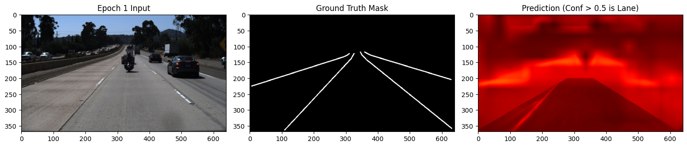
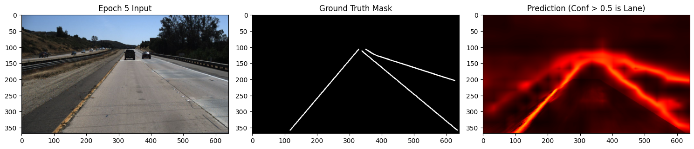
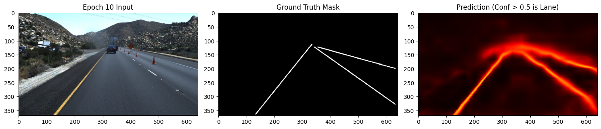
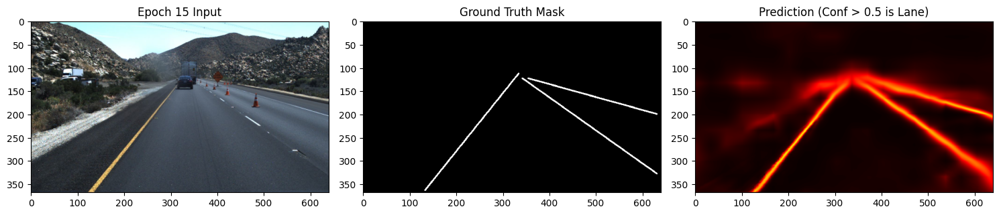

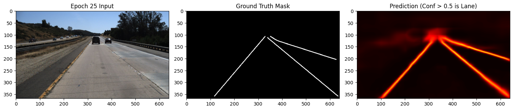

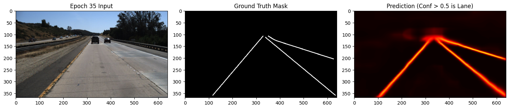
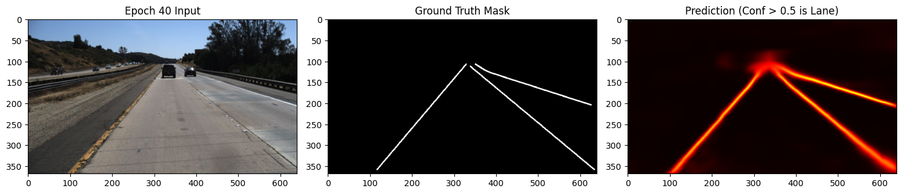

### STLaneNet_Seq

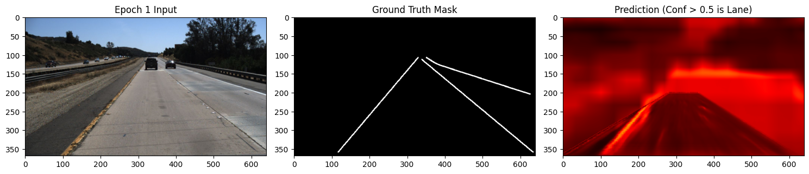
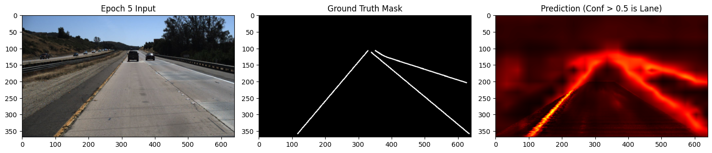
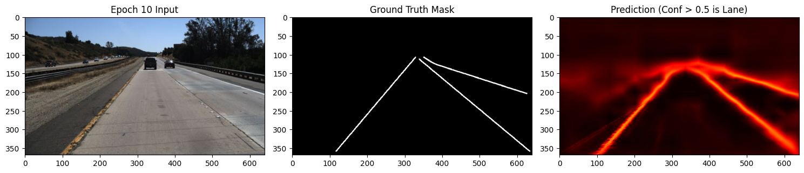
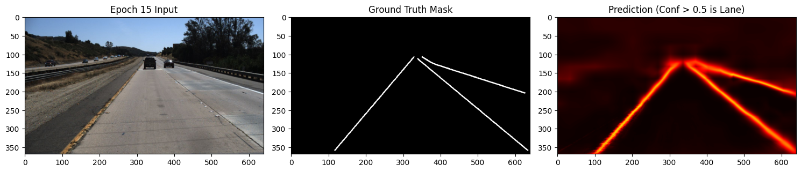

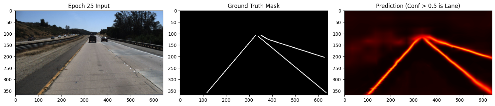

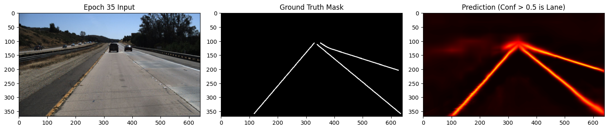
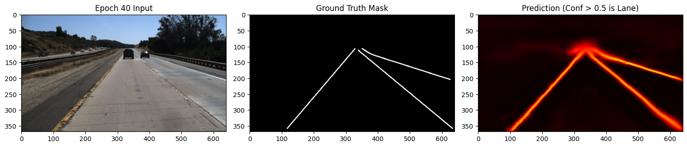

---

## SOTA Comparison

Comparing our best model (`STLaneNet_Seq`) to published results on TuSimple. Note: published results are on the official test set; ours are on the validation split.

| Algorithm | Accuracy (%) | FP | FN |
|---|---|---|---|
| ResNet-34 | 95.11 | 0.0906 | 0.0785 |
| ENet | 95.98 | 0.0875 | 0.0716 |
| LaneNet | 98.08 | 0.0706 | 0.0212 |
| SCNN | 98.12 | 0.0598 | 0.0173 |
| ST-LaneNet (Du et al., 2024) | **98.85** | **0.0565** | **0.0165** |
| **ST-LaneNet (ours)** | **91.86** | 0.1218 | 0.1983 |

**6.99 pp accuracy gap** = training-step deficit: our 4,050 steps vs. the paper's 80,000 steps (~19×). This is the primary cause. The absence of pretrained Swin weights is the secondary factor (standard ImageNet pretrain typically adds 2–5 pp on moderately-sized datasets).

**Speed target surpassed:** 162.9 FPS vs. 64.8 FPS in the paper (2.5× faster), measured on RTX 6000 Blackwell vs. the paper's dual RTX 3060.

---

## Training Curves

Training curves for both variants over 50 epochs are saved to `report_figures/training_curves.png`. The four panels show:
1. Focal training loss — monotonically decreasing, stable.
2. Validation IoU — monotonically increasing.
3. TuSimple validation accuracy.
4. PolynomialLR schedule.

Both variants converge almost synchronously, consistent with their quasi-identical final metrics.

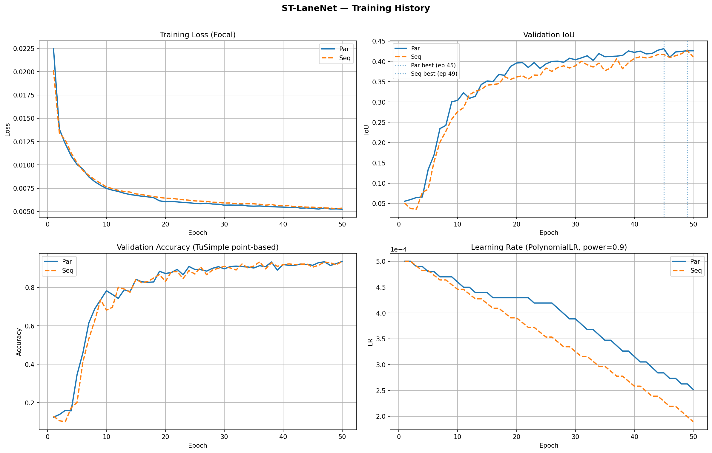

---

## Qualitative Results

4-column qualitative grids saved to:
- `report_figures/qualitative_viz_par.png` (STLaneNet_Par)
- `report_figures/qualitative_viz_seq.png` (STLaneNet_Seq)

Each figure shows 5 rows × 4 samples:
1. Original input image (368×640)
2. Ground-truth mask
3. Raw model prediction
4. Post-processed mask
5. Overlay (prediction on input)

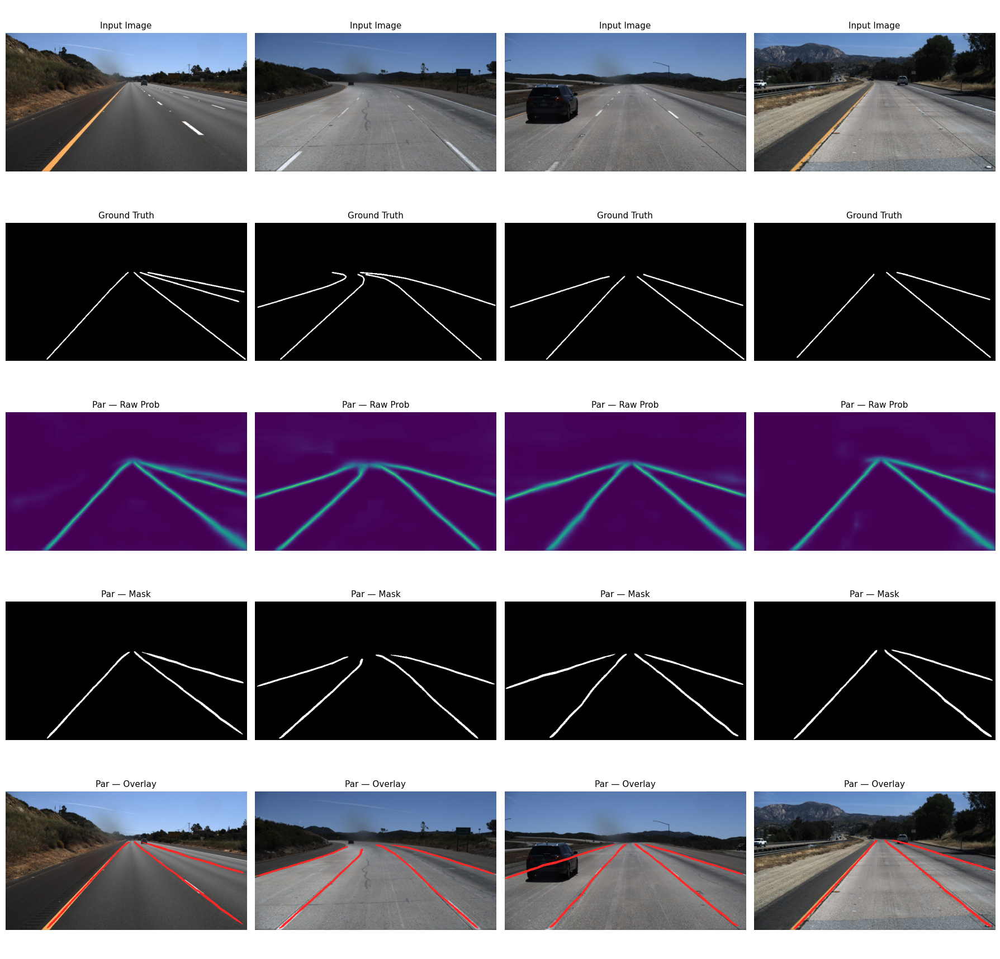


**Observations:**
- Centre and right lanes detected reliably.
- Extreme lateral lanes missed more often (consistent with 19.8% FNR).
- Dual-branch interpretability advantage: the spatial prior (IPM) cleanly eliminates background noise; the Swin branch maintains lane continuity through occlusions.

---

## Spatial Error Heatmaps

Accumulated FP/FN heatmaps over the validation set are saved to `report_figures/spatial_heatmaps.png`.

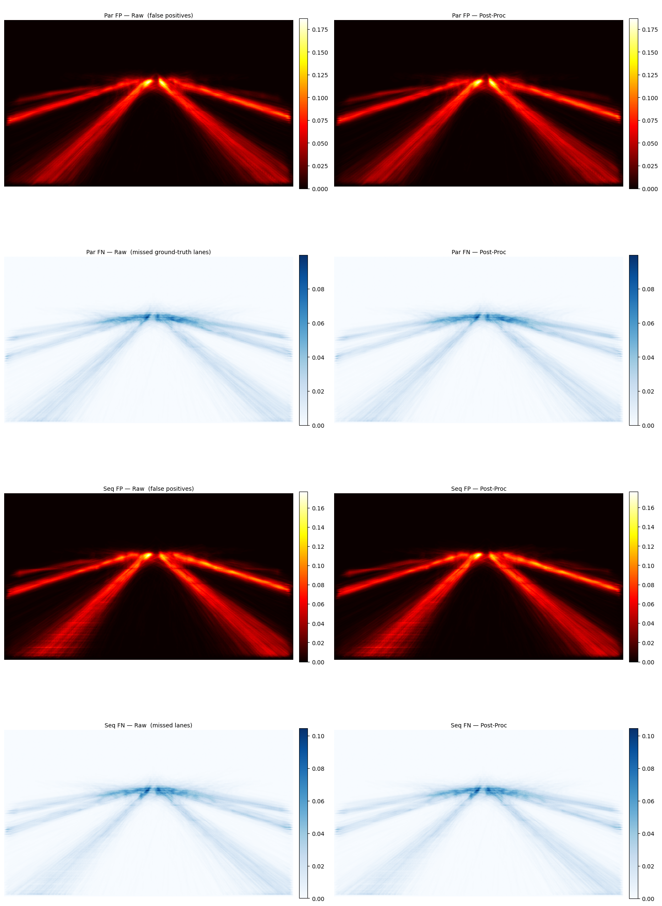

**Two characteristic error patterns:**
1. **FN concentration near the vanishing point (upper image):** Lane lines converge and become sub-pixel thin at reduced resolution — the model fails to segment them.
2. **FP at lateral image borders:** Crash barriers and shadows share texture with lane markings; the model predicts false lanes there.

Suggested improvements: increase input resolution; apply targeted data augmentation for shadow and barrier textures.

---

## Confusion Matrices

Pixel-level confusion matrices (4 panels: Par raw, Par post-proc, Seq raw, Seq post-proc) saved to `report_figures/confusion_matrices.png`. Row-normalised.

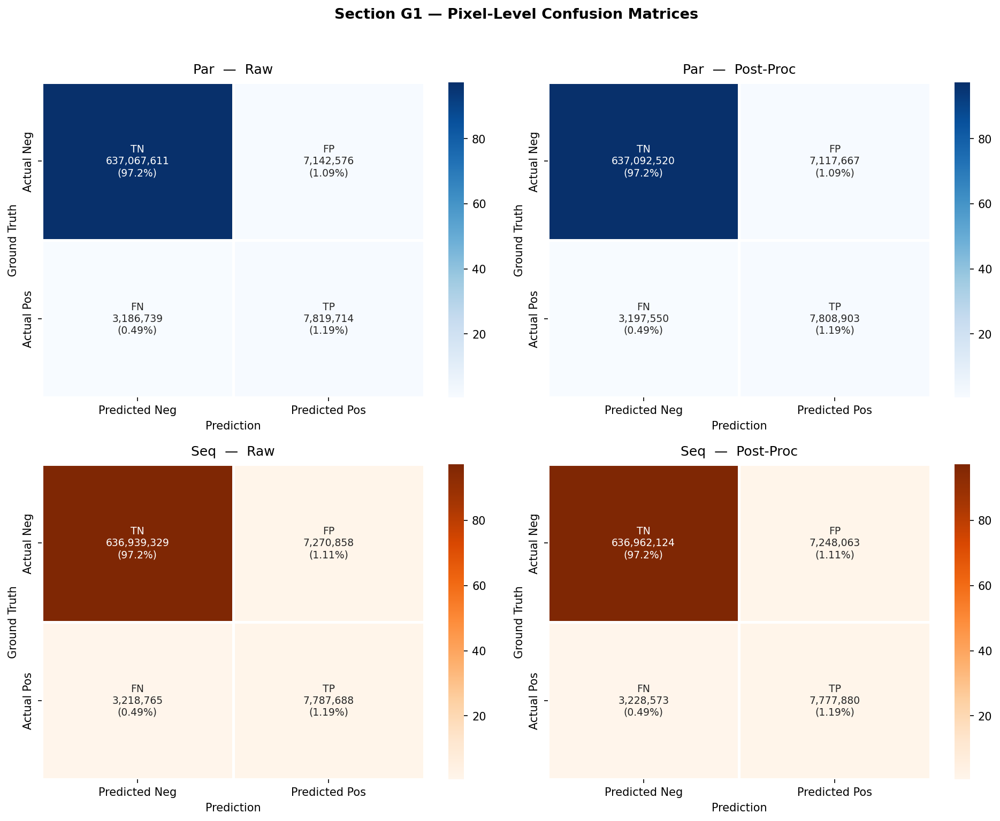

Both variants achieve ~80% recall on the `lane` class with low false-positive rate. Class imbalance (lane pixels <5% of total) is visible in the matrices. Post-processing has marginal and symmetric effects on TP and FP rates.

---

## Reproduction Verdict

| Dimension | Result |
|-----------|--------|
| Architecture | Faithfully reproduced — all modules functional |
| Training convergence | Stable with AdamW + bfloat16 + grad clipping |
| Accuracy | Partially reproduced — 91.86% vs 98.85% paper (step deficit) |
| FPS | Surpassed — 162.9 vs 64.8 FPS (2.5×) |
| Seq/Par ambiguity | Resolved — sequential recommended |

---

## Limitations

1. **Training-step deficit.** 50 epochs ≈ 4,050 steps vs. 80,000 for the authors (×19 less). Increasing to 200–300 epochs on the same Marimo infrastructure would likely reduce the accuracy gap significantly.

2. **No pretrained Swin weights.** The backbone trains from random initialisation. Pretrained ImageNet weights are standard practice and typically add 2–5 pp on medium-sized datasets.

3. **IPM calibration specific to TuSimple.** The homography $H$ is hand-calibrated for TuSimple's camera geometry. Deployment on other camera setups requires re-calibration.

4. **Validation split only.** Metrics are computed on the internal 20% validation split, not the official TuSimple test set. Official test evaluation requires submission to the TuSimple platform.

5. **No per-component ablation.** The architecture combines multiple innovations (CARAFE, DSConv, Focal Loss, IPM, Swin). Their individual contributions are not isolated. This limitation is shared with the original paper.

6. **Single run per variant.** The 0.19 pt F1 difference between Seq and Par is below statistical significance for a single-seed run. Multiple independent runs with confidence intervals would be needed to rigorously confirm equivalence.

---

## Ethics Note

ST-LaneNet is designed for integration in real driving systems.

**Performance risk:** A TPR of 80.2% means approximately 1 in 5 lanes is missed. In production, an undetected lane boundary could cause undetected lane departure, unintended overtaking, or incorrect trajectory planning. This performance level requires active human supervision and is **not suitable for unsupervised deployment**.

**Dataset bias:** TuSimple contains only daytime, clear-weather highway images with clean markings. The model has not been trained or evaluated on night conditions, rain, snow, urban roads, or degraded markings — which collectively represent a large fraction of real-world driving scenarios.
